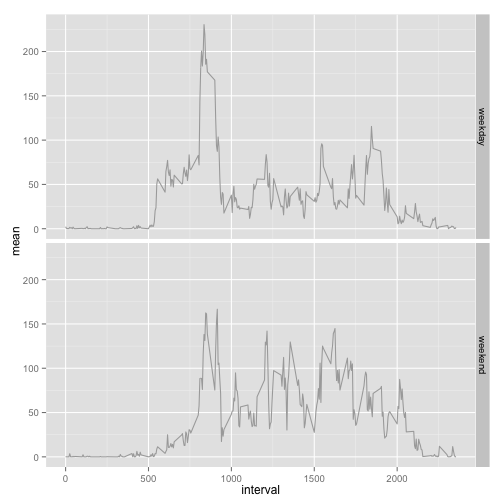

This report is made to comply with the first peer assessment required in the course Reproducible Research, by the John Hopkins University and Coursera. Two months of data collected from an anonymous user of an activity monitoring device is used, specifically the number of steps taken in 5 minute intervals each day during the months of October and November of 2012.

The data was downloaded from the following GitHub repository on may 16th, 2015, at 10:35 am (GMT+6):

https://github.com/rdpeng/RepData_PeerAssessment1/blob/master/activity.zip

It contains the following variables (as described in the same repository):

- steps: Number of steps taking in a 5-minute interval (missing values are coded as NA)

- date: The date on which the measurement was taken in YYYY-MM-DD format

- interval: Identifier for the 5-minute interval in which measurement was taken

The dataset is stored in a comma-separated-value (CSV) file and there are a total of 17,568 observations on it.

To complete this assignment five questions / problems should be resolved, beginning with the loading in the data to be analyzed into R. 

## Loading and preprocessing the data

Once downloaded, the data is stored on the R working directory, then the following code is used to load it into R and store into an R variable called "act.Data". 
**Note:** This and the following code was written using R version 3.1.2, and R-Studio version 0.98, running on MacOS X 10.1.1.


```r
        act.data <- read.csv(unzip("activity.zip"))
```

## What is mean total number of steps taken per day?

The **ggplot2** (which is my choice to make the plots) and **dplyr** libraries are required to be installed and loaded in order to run the code properly. The following code is used to load these libraries.


```r
        library(dplyr)
        library(ggplot2)
```

First, the sum of the the total steps for each day is calculated. For this calculation a wide number of functions and / or packages could be used. After observing that some methods (for example the function **aggregate**) return a 0 for days in which all values were NA, my choice was the library **dplyr**, which excludes those days from the resulting dataframe. This is specially important for the calculations of the mean and the median (evidently to include those zeros would bring different results).  

Other point of interest could be the choice of the parameter **bindwidht = 700**, which simply is one approximation to the default value range / 30. I replaced this default value to avoid a warning message.


```r
        ## 1) Calculates the total number of steps per day
        ## Days with no data recorded (only NAs on the steps column) were exclude
        steps.total <- act.data %>% 
                        filter(!is.na(steps)) %>% 
                        group_by(date) %>% 
                        summarize(total=sum(steps))
        
        ## 2) Creates the histogram
        totalSteps.plot <- ggplot(steps.total)+
                                geom_histogram(aes(x=total), 
                                        alpha=0.8, 
                                        fill="red", 
                                        colour="white", 
                                        binwidth=700)+
                                labs(title="Histogram - Total steps per day")+
                                labs(x="Total steps", y="Number of days")
        print(totalSteps.plot)
```


We should now calculate the mean and the median of this sample:


```r
        stats <- steps.total %>% 
                        summarize(mean=mean(total), median=median(total))
        mean <- format(stats$mean, digits= 2, big.mark=",", scientific=FALSE)
        median <- format(stats$median, digits= 2, big.mark=",", scientific=FALSE)
```

From were we obtain a mean of 10,766 and a median of 10,765 steps per day.

## What is the average daily activity pattern?

To answer this question, the average steps per time interval should be calculated first, and then ploted versus the time interval.


```r
        ## 1) Calculate the average steps per time interval, excluding data with NA values
        steps.mean <- act.data %>% 
                        filter(!is.na(steps)) %>% 
                        group_by(interval) %>% 
                        summarize(mean=mean(steps))
        steps.mean <- steps.mean %>% 
                        mutate(color = (max(mean) == mean))
        
        ## 2) Creates the plot
        ## 2.1) Finds the maximum and converts its time interval to 24H format
        maxValue <- steps.mean[steps.mean$mean==max(steps.mean$mean),]
        hour <- as.integer(maxValue$interval/60)
        minute <- 60*(maxValue$interval/60 - hour)
        time<-paste(hour,":", minute, ", ", format(maxValue$mean, digits=1), sep="")
        
        ## 2.2) Creates the plot
        meanSteps.plot <- ggplot(steps.mean, aes(x=interval, y=mean))+
                                geom_line(colour="darkgray")+
                                geom_point(aes(color=color))+
                                guides(color=FALSE)+
                                labs(title="Mean steps per time interval")+
                                labs(x="Time interval", y="Mean steps")+
        
        ## 2.3) Highlights the maximum value
                                scale_color_manual(values = c(NA, "red"))+
                                annotate("text", 
                                        x=20+maxValue$interval, 
                                        y=maxValue$mean, 
                                        label=time, 
                                        colour="darkred", 
                                        size=3, 
                                        hjust=0)
        print(meanSteps.plot)
```


As we can see, a peak of activity occurs around 13:55, with an average of 206 steps per day.

This makes me wonder, what does this anonymous person did every day for this two months...? A small walk after lunch? run to take the bus to his second job?...We will never know...God bless rainy Saturday afternoons, coffee and R markdown... ;)

## Imputing missing values

As previously mentioned, on this dataset there are multiple NA values. For this question we need to count and report the total number of missing values, task that is accomplished with the following code.


```r
 total.nas <- act.data %>% 
                summarize(total=sum(is.na(steps)))
```

The result is a total of 2304 missing values, that have to be replaced someway by a reasonable value.  
Attending one of the suggestions given in the assignment instructions, I will choose to replace these missing values with the mean value for its correspondent time interval, data that has been already calculated to answer the previous question and stored on the variable "steps.mean", but that its easier to recalculate than to create a pipeline function to match both dataframes.


```r
        new.act.data <- act.data %>% 
                        group_by(interval) %>% 
                        mutate(steps=ifelse(is.na(steps), 
                                                mean(steps, na.rm=TRUE), 
                                                steps))
```

With this new data, I used the same code as before on the question one to make the histogram plot.


```r
        ## 1) Calculates the total number of steps per day
        ## Days with no data recorded (only NAs on the steps column) were exclude
        new.steps.total <- new.act.data %>% 
                        filter(!is.na(steps)) %>% 
                        group_by(date) %>% 
                        summarize(total=sum(steps))
        
        ## 2) Creates the histogram
        new.totalSteps.plot <- ggplot(new.steps.total)+ 
                                geom_histogram(aes(x=total), 
                                        alpha=0.8, 
                                        fill="red", 
                                        colour="white", 
                                        binwidth=700)+
                                labs(title="Histogram - Total steps per day")+
                                labs(x="Total steps", y="Number of days")
        print(new.totalSteps.plot)
```


And I used the same code as before to calculate the mean and the median of this new dataset.


```r
        new.stats <- new.steps.total %>% 
                        summarize(mean=mean(total), median=median(total))
        new.mean <- format(new.stats$mean, digits= 2, big.mark=",", scientific=FALSE)
        new.median <- format(new.stats$median, digits= 2, big.mark=",", scientific=FALSE)
```

From were we obtain a mean of 10,766 and a median of 10,766 steps per day. Because of the chosen method of replacement for the NAs, this results are the same as the obtained before (however please note that the result of the first question could be different if the days where all data is missing were taken into account for the first calculation).

## Are there differences in activity patterns between weekdays and weekends?

Finally, with the new dataset created for the previous question we will compare the results on weekdays and weekends.


```r
        ## 1) Add factor to separate the data
        new.act.data <- new.act.data %>% 
                        mutate(weekday = ifelse(weekdays(as.POSIXct(date))=="Saturday" |
                                                weekdays(as.POSIXct(date))=="Sunday", 
                                                "weekend", 
                                                "weekday")
                        )
                        
        ## 2) Calculates the mean steps per time interval            
        new.steps.mean <- new.act.data %>% 
                                group_by(interval, weekday) %>% 
                                summarize(mean=mean(steps))
                                
        ## 3) Makes the plot        
        weekSteps.plot <- ggplot(new.steps.mean, aes(x=interval, y=mean))+
                                geom_line(colour="darkgray")+ 
                                facet_grid(weekday ~ .)
        print(weekSteps.plot)
```



```r
        ## 4) Calculates some final summary data
        week.stats <- new.act.data %>% 
                        group_by(date, weekday) %>%
                        summarize(total=sum(steps)) %>% 
                        group_by(weekday) %>% 
                        summarize(mean=mean(total))
        weekday.mean <- format(week.stats[week.stats$weekday=="weekday", 2], 
                                digits= 2, 
                                big.mark=",", 
                                scientific=FALSE)
        weekend.mean <- format(week.stats[week.stats$weekday=="weekend", 2], 
                                digits= 2, 
                                big.mark=",", 
                                scientific=FALSE)

        more.100 <- new.steps.mean %>% 
                        filter(mean>=100) %>% 
                        count(weekday)
        weekday.100 <- more.100[more.100$weekday=="weekday", 2]
        weekend.100 <- more.100[more.100$weekday=="weekend", 2]
```

From this two plots, we can observe that the shape of the time series is different from weekdays to weekends:  

 - First, we don't observe a hight peak of activity on weekends around 2:00 pm.
 - The number of time intervals with a mean above 100 steps on weekends is 32, while on weekdays is 15.
 - Finally, the mean steps on weekdays is 10,256, meanwhile on weekends is 12,202.
 
In short, we can conclude that on average the weekends are more active, but on weekedays there are intervals with higher intensity.
